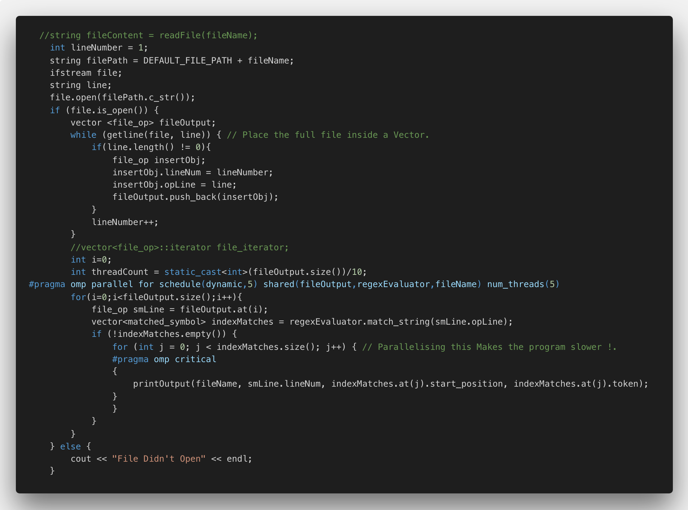

# CSE 330 Project

## Program Status 
- Concatenation : `ab`
- Union : `a+b`
- Kleene Start : `a*`
- Parentesis based mixed Operators : `(l*o)+(o*)`
- Parallelised Code. 

### Bugs
- No Bugs currently discovered. 
- variety of test cases tried. 
- If improper regex string is an input then the program might fail.
- When writing the parallel part of the code there were issues with parallelising nested loops and threads. These got solved by an OpenMP method which allows the nested spawning of threads. 
- Code works properly but will require more refactoring as there are a lot of unused methods and redundant methods.

## Process Flow
- Parse regular expression string to readable regex string with missing operators such as concatenation
- Parse the preprocessed Regex to postfix notation using Shunting Yard Algorithm.
- Evaluate the postfix string with an NFA class that creates resultant NFA's based on Thompson's construction. 
- Convert the final resultant NFA from postfix evaluation to a DFA Using Subset Construction
- Create a node graph from the resultant DFA
- Evaluate the text in the files by traversing the graph using recursion and print the matching values when a final state is reached in the graph.

## Data Structures
- `class NFA` : Contains Methods to create an NFA and a DFA from any NFA. 
- `struct transition` : stucture that represents the transiton between the nodes of the automaton. It contains the starting and ending edge and the symbol of transition.
- `vector<transtion>` : Vector containing the infomation needed to construct the node graph of the Automaton.
- `vector< vector<trans> > dfa_node_graph` : actual graph used for Traversing the Tree. 
- `struct matched_symbol` : The structure that stores the matched tokens and postion of matched tokens from the text on which the search takes place. 

## Algorithms 

- `string changeRegexOperators()`: Regex Preprocess : adds the missing concatenation symbol to convert to postfix. 
- `string convertRegexToPostfix()`: Shuntting Yard Algorithm : To convert infix regex into postfix notation
- `NFA postFixNFABuilder()`: Post Fix Evaluation with Thompson Construction : A Method to build the final NFA from a postfix regular expression
- `void convert_to_dfa()::NFA`: Subset Constuction : Algorithm to convert the NFA to DFA. Uses `set<int> epsilon_closure ::NFA` and `set<int> move::NFA` to find the resulting DFA states.  
- `vector<matched_symbol> traverse_dfa_graph()::NFA`: DFS with Recurrsion : DFA Node graph explored with recursion. No backtracking supported in the algorithm as DFA's are deterministic to once a path is chosen in a graph there is no point in back tracking. String matching takes place here.  a `vector<matched_symbol>` holds the tokens that got matched. 

## PARALLELISATION PROCESS
- After profiling the serial program the below was the output of the execution

- The profiler showed that majority of the time of execution was spent by the `searchFile()` and `NFA.match_string()` methods. The `searchFile()` method finds the lines of the file and the `NFA.match_string()` matches the expression to the string. 
- When other methods were parallelised there was an increase in runtime because of the overhead of spawning threads. 
- So on basis of the profiling there were two major Approaches to parallelism the code : 
  - Parallelise the number of files that are given to the code. 
  - Use threads to process the lines in each files. 
- Parallelising the files was easy as the for loop required one `#pragma omp for` directive. 
- While spawning threads for the lines of each file, there needed to be change in the serial. As seen below in the snapshot of the serial code, there is a while loop being used to extract the lines and find the pattern in the lines 

- The `while` loop needed to be converted to a `for` loop so that the data can be split up among threads and processed in a parallel way. To do so, a `vector<file_op>` is used where `file_op` is a structure containing the line number and the line in the file. The file is first read and loaded with the lines and line number for each line inside the vector. Post that the processing is done in parallel

- When printing matches in the parallelised line reading, there was a need for the `#pragam omp critical` directive to ensure that only one line is printed at a time amongst all the threads.  

 

## SERIAL VS PARALLEL COMPARISON

- The comparison was done on two parameters with a constant input to get a good idea of the performance of the code for serial and parallel. The comparison is done with respect to number of files and the number of processors. The comparsion was done with a simple and comparatively complex pattern. 
- Even though the code can handle extreamely complex patterns, the choice of patterns was for the sake of getting a balance understanding of the runtime WRT the parameters. 
- Input parameters are varied with complex and simple patterns
---
- Search Query for the comparison : `and`
- Comparison of Runtime to the Number Of Files for Serial and parallel Code.
  
- Comparison of Runtime to the Number Processors for Serial and parallel Code.
  

 

CORES|	SPEED UP|
| ------------- |-------------|
2|	1.92355138|
4|	2.364533891|
6|	2.912817653|
8|	2.954444228|
12|	3.806473357|

FILES|	SPEED UP|
| ------------- |-------------|
1|	2.088177413|
2|	3.091235729|
3|	2.980249034|

- Search Query for the comparison : `and+gr(e)*n`
- Comparison of Runtime to the Number Of Files for Serial and parallel Code.
  
- Comparison of Runtime to the Number Processors for Serial and parallel Code.
  

CORES|	SPEED UP|
| ------------- |-------------|
2|	1.534224302|
4|	3.05615201|
6|	3.228171558|
8|	3.495240695|
12|	3.577697751|

FILES|	SPEED UP|
| ------------- |-------------|
1|	2.52635008|
2|	3.375402399|
3|	3.047199051|
---

- Circumstances needed before a speed-up is observed
  - There is speedup because there is a parallelisation at two levels :  at the number of files and the individual lines in the files. Because of the nested method of threading the work distribution takes place in case of any typeof input. May it be one file or multiple files.
  - The only case where the program is equivalent in performance to the serial code is when there is only one line and one file.
  -  With the increase in the number of cores a speedup is likely to happen because there are just more processors to distribute the work. 

## Interactions and Citations

- When I first approached the problem I tried to solve it using normal string matching but the solution was not the most optimal solution. After consulting William Sengir I realised that ordinary string matching with KMP algorithm and finding the largest word in the string is a half baked solution. 
- Looking for more solutions and desperately trying to avoid using NFA's and DFA's I spoke to more class mates such as Craig Ignatowski who suggested me solutions like grep in linux. But Even though the thoughtprocess was good the solution was not complete. 
- Finally after reading a lot online and in Books *Beautiful Code* and *The Practice of Programming by Brian W. Kernighan* I realised that the most optimal solution will come by using NFA' and DFA's.
- While parallelising the code there was an issue at the end with the having nested threads. Michelle(TA) helped me research a method in the OpenMP library that helped fix this issue in the code.  

## REFERENCES 

1. [C++ Best Practices](https://github.com/lefticus/cppbestpractices)
2. [Ways to Create String Arrays](https://www.geeksforgeeks.org/array-strings-c-3-different-ways-create/)
3. [I/O with Files C++](http://www.cplusplus.com/doc/tutorial/files/)
4. [Array Vs Vectors In C++](https://www.educba.com/c-plus-plus-vector-vs-array/)
5. [How Arrays Are Treated Within Functions](https://www.geeksforgeeks.org/how-arrays-are-passed-to-functions-in-cc/)
6. [Passing a Vector to Function in C++](https://www.geeksforgeeks.org/passing-vector-function-cpp/)
7. [Using Iterators with Vectors](https://www.geeksforgeeks.org/iterators-c-stl/)
8. [Using Cont Iterators When iterating Through Constant Arrays.](https://stackoverflow.com/questions/15020954/vector-iterator-no-match-for-operator)
9. [Shunting Yard Algorithm Psuedo Code](https://brilliant.org/wiki/shunting-yard-algorithm/)
10. [Using :: in C++](https://stackoverflow.com/questions/15649580/using-in-c)
11. [Stacks in C++](https://www.geeksforgeeks.org/stack-push-and-pop-in-c-stl/)
12. [Queues in C++](https://www.geeksforgeeks.org/queue-cpp-stl/)
13. [Printing Vectors in C++](https://www.techiedelight.com/print-vector-cpp/)
14. [Reference in C++](http://yosefk.com/c++fqa/ref.html)
15. [Pointers Vs References in C++](https://www.geeksforgeeks.org/pointers-vs-references-cpp/)
16. [KMP Search Algorithm](https://en.wikipedia.org/wiki/Knuth%E2%80%93Morris%E2%80%93Pratt_algorithm)
17. [Pointers vs. References in C++](https://stackoverflow.com/questions/57483/what-are-the-differences-between-a-pointer-variable-and-a-reference-variable-in)
18. [Building NFAs with Thompson Construction](https://xysun.github.io/posts/regex-parsing-thompsons-algorithm.html#)
19. [Building Regex Machine with NFAs](https://medium.com/@DmitrySoshnikov/building-a-regexp-machine-part-2-finite-automata-nfa-fragments-5a7c5c005ef0)
20. [Subset Construction For Converting DFA to NFA](https://studylib.net/doc/5870948/the-subset-construction-algorithm)
21. [Regex Engine In Python For Thompson Construction](https://github.com/xysun/regex)
22. [Thompson's Construction With C++](https://github.com/kennyledet/Algorithm-Implementations/tree/master/Thompsons_Construction_Algorithm/C%2B%2B/AlexMathew)  
23. [The Practice of Programming by *Brian W. Kernighan*](http://index-of.co.uk/Etc/The.Practice.of.Programming.-.B.W..Kernighan..pdf)
24. [Beautiful Code *(O'Reilly)*](http://shop.oreilly.com/product/9780596510046.do)
25. [Subset Construction From NFA](http://www.cs.may.ie/staff/jpower/Courses/Previous/parsing/node9.html)
26. [Nested Parallelism with OpenMP](https://docs.oracle.com/cd/E19205-01/819-5270/aewbc/index.html)

## Author 
 - [Valay Dave](<vddave@asu.edu>)